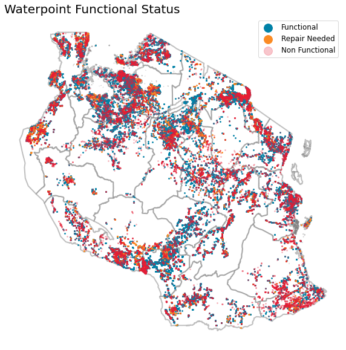
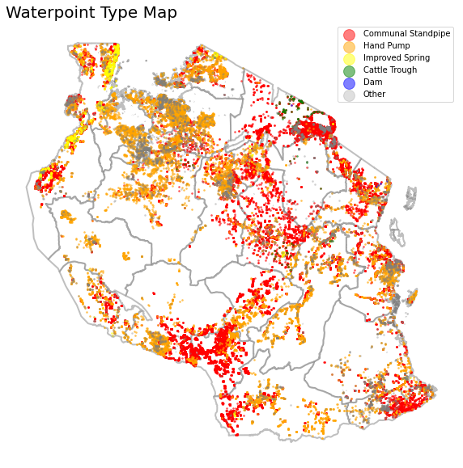
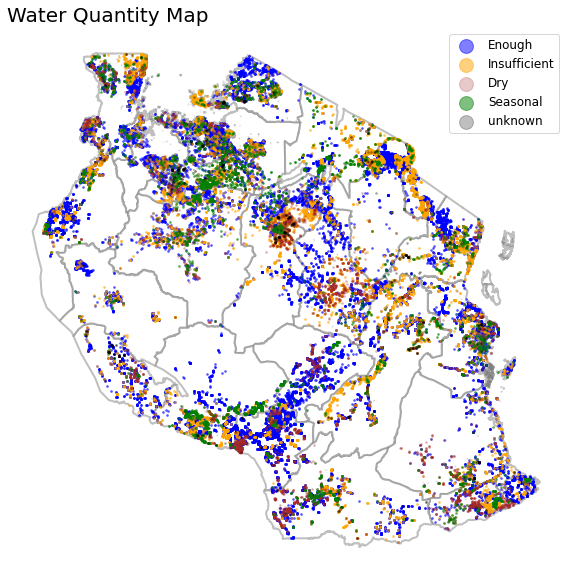
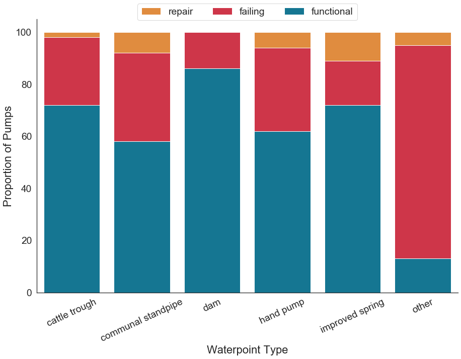
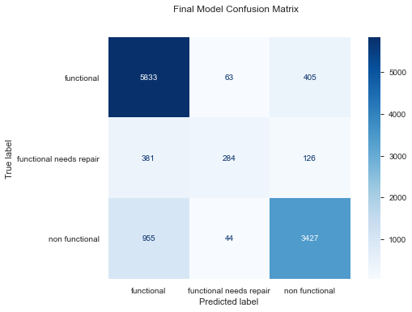

# Tanzania Water Well Classification

Analysis and model by Matt Carr, Dann Morr, and Amanda Potter

# Table of Contents
- [Repo Structure and Directory](#Repo-Structure-and-Directory)
- [Introduction](#Introduction)
- [Goal](#Goal)
- [Data Set](#Data-Set)
- [Definitions](#Definitions)
 - [Water well status](#Water-well-status)
 - [Water Quality definitions](#Water-Quality-definitions)
- [Methodology](#Methodology)
- [Summary of Model](#Summary-of-Model)
- [Conclusions and Recommendations](#Conclusions-and-Recommendations)
    

## Repo Structure and Directory
- [Exploratory Notebooks](https://github.com/mattcarr17/mod_3_flatiron_project/tree/master/notebooks/exploratory)
- [Report Notebook](https://github.com/mattcarr17/mod_3_flatiron_project/tree/master/notebooks/report)
- [Project Presentation](https://github.com/mattcarr17/mod_3_flatiron_project/blob/master/reports/Presentation.pdf)
- [Data download](https://github.com/mattcarr17/mod_3_flatiron_project/tree/master/data)
- [src/ directory with project source code](https://github.com/mattcarr17/mod_3_flatiron_project/tree/master/src)
- [figures/ directory with project visuals](https://github.com/mattcarr17/mod_3_flatiron_project/tree/master/reports/figures)
- [Data references](https://github.com/mattcarr17/mod_3_flatiron_project/tree/master/references)
- [Project Conda environment](https://github.com/mattcarr17/mod_3_flatiron_project/blob/master/Wells.yml)

## Introduction
Tanzania, as a developing country, struggles with providing clean water to its population of over 57,000,000. There are many waterpoints already established in the country, but some are in need of repair while others have failed altogether.  Understanding which waterpoints will fail can improve maintenance operations and ensure that clean, potable water is available to communities across Tanzania.

## Goal
This project seeks to develop a model to classify the functional status of water wells in Tanzania, using data from Taarifa and the Tanzanian Ministry of Water.  This analysis is being prepared for the Tanzanian Ministry of Water to aid in improving maintenance operations by lessening the number of fully functional waterpoints that are to be inspected for repairs and limiting those inspections to the waterpoints that have a high liklihood of being in need of repair or having failed altogether.  

## Data Set
This project uses the data from the [Pump it Up: Data Mining the Water Table](https://www.drivendata.org/competitions/7/pump-it-up-data-mining-the-water-table/page/23/) competition on [Driven Data](https://www.drivendata.org/), originally compiled by Taarifa and the Tanzanian Ministry of Water.

A cleaned copy of the data is saved in this repo as `data/geodata_clean.csv`.

## Definitions
### Water well status
Functional - supplies adequate water to the population

Functional needs repair - has less than 3 months of interruption in service.

Nonfunctional  - has more than 3 months of interruption

### Water Quality definitions
Milky — Indication of turbidity as measured in NTU, water will appear milky white at 4 NTU. For household use, turbidity should ideally be kept below 5 NTU. Milky-white can also be caused by supersaturated air being released. This could have been introduced during pipe repair, or following changes in water pressure.
https://www.who.int/water_sanitation_health/publications/turbidity-information-200217.pdf

Soft — Indication of the level of calcium carbonate present in water. Below 60 mg/L is considered soft water.
https://www.usgs.gov/special-topic/water-science-school/science/hardness-water?qt-science_center_objects=0#qt-science_center_objects

Salty — measure of salinity. Fresh water contains less than 1000 ppm of dissolved salts. For our purposed assume salty is slightly or moderately saline — between 1000 and 10000 ppm dissolved salts. Ocean water is roughly 35000 ppm dissolved salts
https://www.usgs.gov/special-topic/water-science-school/science/saline-water-and-salinity?qt-science_center_objects=0#qt-science_center_objects

Fluoride — water from rivers, lakes, springs with fluoride concentration exceeding 1.5mg/L. https://www.hindawi.com/journals/jchem/2018/7140902/

Colored — indication of dissolved, suspended materials. A brown shade is generally an indication of rusted pipes. For our purposes we will assume that the water is generally safe and is an indication of rust.
https://www.usgs.gov/special-topic/water-science-school/science/water-color?qt-science_center_objects=0#qt-science_center_objects

    
## Methodology
This project will utilize a supervised classification machine learning algorithm to classify the functional status of water well pumps.
Our final model is a Random Forest Classifier.
    
We are primarily concerned with correctly identifying the wells in the catergories *Nonfunctional* and *Functional needs repair* and will be using *recall* as our primary metric for the classification model.  This aim is to reduce the number of nonfunctioning wells or wells in need of repair that are incorrectly identified as being functional. 
    
We needed to make some assumptions about the data for this project, these are as follows:
- The functional status of a well as recorded in our data set is current and correct.
- A functional well is currently providing adequate water supply to the population with no interruption in service caused by the pump itself.
-  A functional, in need of repair well is currently providing adequate water supply to the population with some service interruption in service caused by the pump.  For this well to move to the 'functional' class, the pump will need repair.
- A nonfunctional/failed well is no longer providing adequate water supply to the population and the pump will need to be replaced or a new well installed to bring the waterpoint back to a functional state.

Our EDA ascertained that the data set contained several columns of duplicated categorical information. Many of the columns containing containous variables were missing values and/or had large portions of the values as "0". These were dropped before running models.

We developed many visualizations to illustrate the geographic locations of the waterpoints, as well as the quality of water and quantity of water. 

The map above shows the distribution of the different functionality status of waterpoints across Tanzania. Of the nearly 60,000 observations in the dataset, only a small proportion, about 4,000, were considered functional but in need of repair. The map above clearly reflects this as the majority of the points on the map are considered either functional or non functional. As the map shows, both functional pumps and non functional pumps are pretty evenly distributed across the entire country.

The vast majority of pumps were either Communal Standpipe or Hand Pump both of which can be seen all across the country. Communal Standpipe's are slightly less prevelant in the North-Western region of Tanzania but this portion contained mainly Hand Pump. During our anlysis, we found these two pump types to have the highest rate of non functionality. The simpler pumps such as Dam or Improved Spring had lower rates of failure, yet were much less used throughout the country.

The WHO defines a waterpoint as supplying 'Enough' water if it can provide 50-100 liters of water per day to each person using the waterpoint. We found that across the country, a waterpoint was used by an average population size of 186. This means these pumps needed to be pumping out nearly 20,000 liters of water each day to be considered as supplying 'Enough' water. 

Additionally we plotted graphs comparing the status of waterpoint by type.

As mentioned in the waterpoint type map above, Communal Standpipe and Hand Pump were the two most prevalent waterpoint types in the entire country. Yet, besides other, they had the highest rate of non functionality. It is still unclear from our analysis why the pumps considered 'other' had such a high rate of failure and was something we would have liked to explore more if time permitted.

## Summary of Model 

### Target: Status Group
Functional, Nonfunctional, or Functional needs repair

### Features
- lga (Geographic Location)
- quantity_group (Quantity of Water)
- quality_group (Quality of Water)
- management_group (How the waterpoint is managed)
- extraction_type (The kind of extraction the waterpoint uses)
- source_type (The source of the water)

### Final Model
The final model was a Random Forest Classifier that achieved an overall Recall Score of  0.83.

The recall scores for each catergory are as follows:
- Functional  0.93
- Nonfunctional 0.77
- Functional needs repair 0.36

## Conclusions and Recommendations

The model performed best at the Functional wells, did adequately on Nonfunctional wells, and had the most trouble correctly predicting the Functional needs repair.

We found that overall the data was not reliably gathered, so the results were not expected to be particularly accurate.

Further recommendations are:

- Focus resources on pumps that are failing or in need of repairs.

- Implement pumps types in the future that are least likely to fail.

- Work with local governments to ensure accurate gathering of further data.

- Create standard definition for governments to follow when classifying functional status of water pumps.

    
## Further exploration 
- Are there areas/regions that have more failing wells?
- Does water quality appear to contribute to the likelihood of a well failing/needing repair?
- How is the status of a well associated with the population using the well, if at all?
- Is there a difference in rates of failure/repair between groundwater and surface water wells?
- is there a difference in failure/repair with the type of pump?
- Does the age of the well indicate liklihood of needed repair or failure?
        
        

